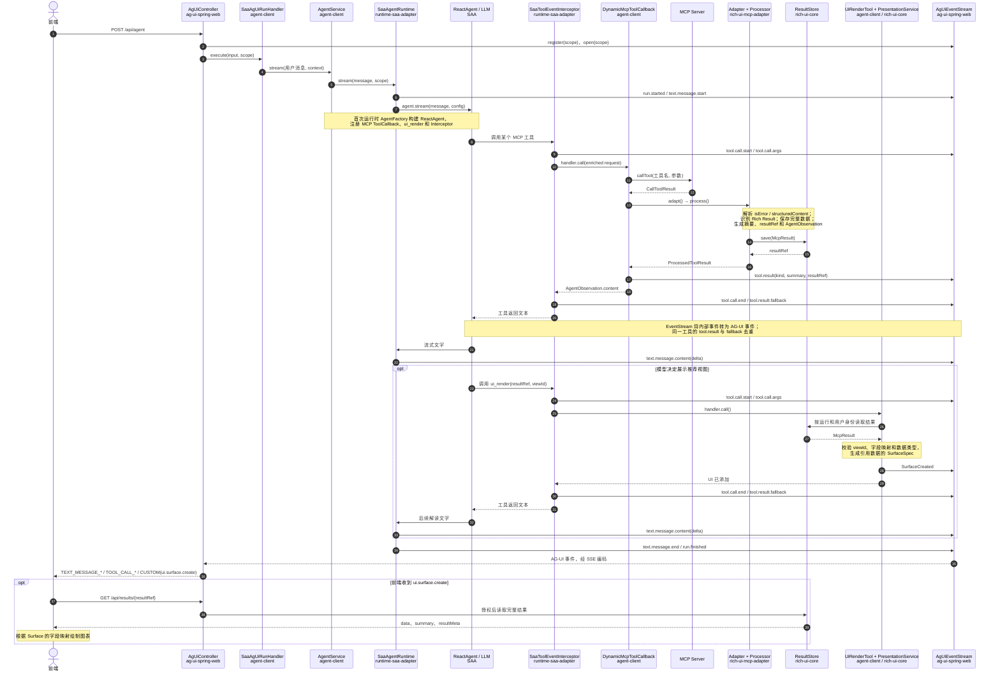

我会把一次 `/api/agent` 请求拆成两条相连的时序：MCP 工具取数与结果处理，以及 `ui_render` 生成前端事件。先核对 Web 入口和事件流的实际调用关系。

可以。下面这张图按**一次普通对话中，Agent 调用 MCP 工具并生成图表**的顺序画。横向是类及所属模块；`EventStream` 是旁路事件通道，Agent 的工具返回值仍沿原调用栈返回。

读图时抓住三个返回方向：

- **给 Agent 的返回值**：`DynamicMcpToolCallback → Interceptor → ReactAgent`，内容是 `AgentObservation.content`，供模型继续推理。[DynamicMcpToolCallback.java](/D:/myprog/idea_21/jclaw/ag_ui/ai-mcp-platform/agent-client/src/main/java/com/ac/agent/mcp/tool/DynamicMcpToolCallback.java:69)
- **给前端的实时事件**：各层调用 `RuntimeEventSink.publish`，进入 `AgUiEventStream`，再由 `AgUiController` 作为 SSE 返回。它与工具方法的返回值是两条路径。[AgUiEventStream.java](/D:/myprog/idea_21/jclaw/ag_ui/ai-mcp-platform/ag-ui-spring-web/src/main/java/com/ac/agui/web/stream/AgUiEventStream.java:85) · [AgUiController.java](/D:/myprog/idea_21/jclaw/ag_ui/ai-mcp-platform/ag-ui-spring-web/src/main/java/com/ac/agui/web/api/AgUiController.java:56)
- **给图表的完整数据**：留在 `ResultStore`；SSE 的 Surface 只携带 `dataRef`，前端再通过 `/api/results/{resultRef}` 读取。[UiRenderTool.java](/D:/myprog/idea_21/jclaw/ag_ui/ai-mcp-platform/agent-client/src/main/java/com/ac/agent/presentation/tool/UiRenderTool.java:24) · [ResultController.java](/D:/myprog/idea_21/jclaw/ag_ui/ai-mcp-platform/agent-client/src/main/java/com/ac/agent/web/ResultController.java:21)

图中的 `Adapter + Processor` 展开后是 `McpCallToolResultAdapter → DefaultRichToolResultProcessor → DefaultMcpResultDecoder / ResultStore / DefaultObservationBuilder`；`ui_render` 则通过 `DefaultPresentationService → PresentationValidator → PresentationMapper` 生成 Surface。Agent 的工具和拦截器在 [AgentFactory.java](/D:/myprog/idea_21/jclaw/ag_ui/ai-mcp-platform/agent-client/src/main/java/com/ac/agent/agent/AgentFactory.java:58) 中装配。