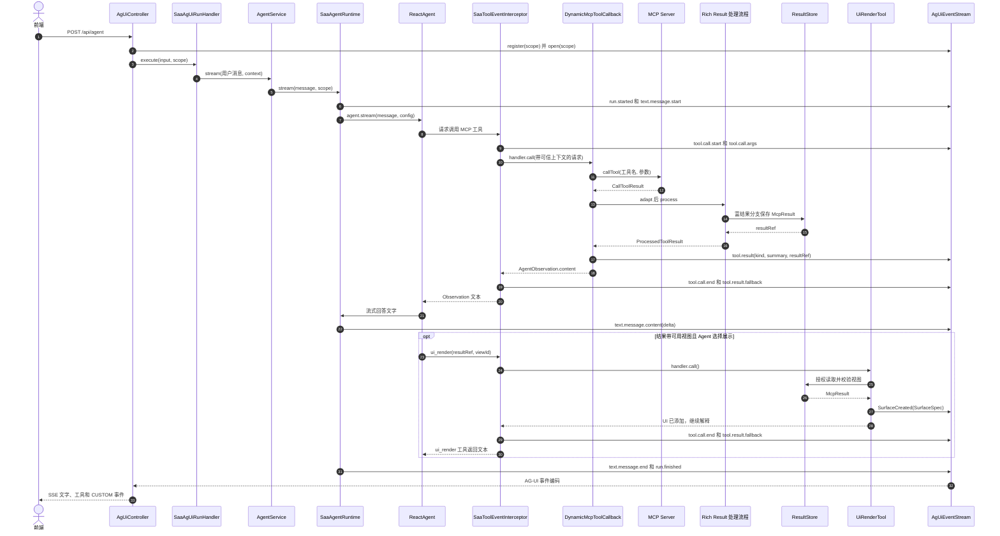
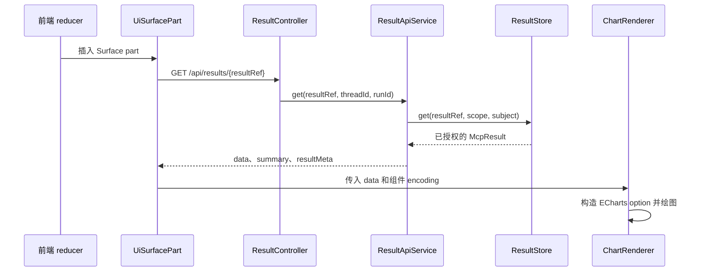

# agent-client 调用过程分析

> 基于当前工程源码的静态分析。本文聚焦 `agent-client` 使用 Spring AI Alibaba `ReactAgent` 的路径；`agentscope-client` 有独立的 Runtime 适配实现。本文不把设计方案中的预期行为当作已实现行为。

## 1. 先看三条不同的数据路径

一次 MCP 工具调用后，有三类信息分别走不同的路径：

| 路径 | 内容 | 接收方 | 作用 |
| --- | --- | --- | --- |
| 工具返回值 | `AgentObservation.content` | `ReactAgent` / 模型 | 让模型知道查询摘要、`resultRef` 和可用的 `viewId`，继续推理或调用工具 |
| 实时事件 | `tool.call.*`、`tool.result`、`SurfaceCreated`、文字增量 | `AgUiEventStream` → AG-UI SSE → 前端 | 展示工具状态、流式文字和 UI Surface |
| 完整业务数据 | `McpResult.data` 等 | `ResultStore` → `/api/results/{resultRef}` → 前端 | 按授权读取，供组件实际绘制 |

`DynamicMcpToolCallback` 在处理 MCP 结果后同时产生前两类输出：调用 `RuntimeEventSink.publish` 发布安全的结果摘要事件，并将 Observation 文本作为工具返回值。完整数据由处理器存储，前两条路径都不直接搬运完整数据。

## 2. 模块与关键类的职责

| 模块 | 关键类 | 职责 |
| --- | --- | --- |
| `ag-ui-spring-web` | `AgUiController`、`AgUiEventStream`、`ResultApiService` | 注册运行，启动处理器，维护按 run 隔离的事件流，提供 SSE 和结果读取服务 |
| `agent-client` | `SaaAgUiRunHandler`、`AgentService`、`AgentFactory` | 将 AG-UI 输入转为 Agent 请求，懒加载 Runtime，装配 `ReactAgent`、MCP 工具、`ui_render` 和拦截器 |
| `runtime-saa-adapter` | `SaaAgentRuntime`、`SaaToolEventInterceptor` | 执行 Agent 流、发布文字及运行事件；给工具调用加入可信上下文并发布调用生命周期事件 |
| `agent-client` | `McpToolRegistry`、`McpToolCallbackFactory`、`DynamicMcpToolCallback` | 发现 MCP 工具、创建 Spring AI `ToolCallback`、调用远端 MCP 工具并将结果送入公共处理流程 |
| `rich-ui-mcp-adapter` | `McpCallToolResultAdapter`、`DefaultMcpResultDecoder`、`DefaultRichToolResultProcessor` | 从 MCP SDK 对象提取原始结果，区分普通结果、富结果和错误，构造 `ProcessedToolResult` |
| `rich-ui-core` | `ResultStore`、`DefaultObservationBuilder`、`DefaultPresentationService`、`PresentationValidator`、`PresentationMapper` | 保存和授权读取结果；构造模型观测；校验视图并映射为 `SurfaceSpec` |
| `mcp-contract` | `McpResult`、`ViewHint`、`SurfaceSpec` | 定义业务结果、候选视图和已选择的 UI Surface 契约 |
| `ag-ui-protocol` | `AgUiEventTranslator` | 将内部事件转为 AG-UI 事件，处理工具结果顺序和去重 |
| `packages/agent-ui` | `reducer.ts`、`UiSurfacePart.vue`、`ChartRenderer.vue` | 消费事件、插入 UI part、按 `dataRef` 取数并绘图 |

`AgentFactory` 在首次创建 Agent 时发现已启用 MCP Server 的工具，得到 `ToolCallback` 集合，再加入 `ui_render`，并把 `SaaToolEventInterceptor` 注册到 `ReactAgent`。工具定义和实际回调的创建分别见 `McpToolRegistry`、`McpToolCallbackFactory`。这属于装配过程，不会在每次工具返回后重新创建 Agent。

## 3. 一次请求的调用时序

下面以「用户提出分析问题 → Agent 调用 MCP 工具 → 可能展示图表」为例。`ui_render` 是条件分支，不是每个 MCP 调用的必经步骤。



这张图把 `McpCallToolResultAdapter`、`DefaultMcpResultDecoder`、`DefaultRichToolResultProcessor` 和 `DefaultObservationBuilder` 合并为 `Rich Result 处理流程`；第 5 节展开其内部分支。`AgUiController` 启动执行和订阅事件流；它不是等待 `AgentService.stream()` 返回完整回答后再组装 SSE。`SaaAgUiRunHandler.execute()` 对 Agent 的 `Flux<String>` 调用 `.then()`，实际响应内容从事件通道流出。

## 4. MCP 工具是怎样被调用的

1. `SaaToolEventInterceptor.interceptToolCall()` 取得 SAA 执行上下文，确定 `toolCallId`，将可信的 `RunScope` 写入工具上下文，发布 `tool.call.start` 和经过限制的 `tool.call.args`。
2. 拦截器调用 `handler.call(enriched)`。对于动态注册的 MCP 工具，此时进入 `DynamicMcpToolCallback.call(String, ToolContext)`。无 `ToolContext` 的 `call(String)` 重载直接拒绝调用。
3. `DynamicMcpToolCallback` 从可信上下文取得 `RunScope`，解析模型提供的工具参数，经 `McpClientManager.getClient(serverCode).callTool(...)` 调用远端工具。
4. MCP 原生 `CallToolResult` 依次经过 `McpCallToolResultAdapter.adapt()` 和 `RichToolResultProcessor.process()`。
5. 回调发布 `tool.result`，然后返回 `processed.observation().content()`。拦截器收到工具响应后发布 `tool.call.end` 与兜底 `tool.result.fallback`。

拦截器与回调的分工不同：前者管理**所有 SAA 工具调用**的身份、开始、参数、结束及兜底结果；后者只处理**MCP 工具**的远端调用与富结果。`ui_render` 也经过拦截器，但不经过 `DynamicMcpToolCallback`。

## 5. MCP 返回结果的识别与 `AgentObservation`

### 5.1 原生 MCP 结果转换

`McpCallToolResultAdapter` 从 `CallToolResult` 提取：

- `isError`：协议或工具执行错误标志；
- `structuredContent`：优先使用的结构化对象；
- `content` 中所有文本块：合并为文本，供降级和错误处理。

`DefaultMcpResultDecoder` 按以下顺序解码：先判断 `isError`；否则优先读取 `structuredContent`；没有结构化内容才尝试把文本解析为 JSON 对象；非 JSON 文本作为普通结果。含 `success`、`specVersion`、`presentation`、`summary` 或 `error` 等字段的对象按平台的 `McpResult` Envelope 解析。普通结构化对象也会被包装成成功的通用结果，但 `presentation=NONE`，不会凭字段名或数字猜测图表。无法满足富结果契约的对象归为 `INVALID_RICH_RESULT`。

### 5.2 处理器的四类输出

| 解码结果 | `ProcessedToolResult.kind` | 是否保存到 `ResultStore` | `AgentObservation.content` |
| --- | --- | --- | --- |
| 成功的富结果，包括被包装的普通结构化对象 | `RICH_RESULT` | 是 | 状态、可用的摘要、`resultRef`；有视图时还包含视图信息 |
| 业务失败的 `McpResult` | `BUSINESS_ERROR` | 是 | 业务失败、错误代码、错误信息、可重试标志和 `resultRef` |
| 普通文本结果 | `PLAIN_RESULT` | 否 | 脱敏并截断后的文本 |
| MCP 执行错误或无效富结果 | `MCP_ERROR` | 否 | 脱敏并截断后的错误文本 |

富结果经 `ResultStore.save(scope, tool, result)` 获得引用，再由 `DefaultObservationBuilder` 构造 Observation。`ProcessedToolResult` 还含 `publicSummary`，供前端工具结果事件使用；它与返回给模型的 `AgentObservation` 不是同一个字段。普通结果的 Observation 最长 4000 字符、前端摘要最长 500 字符；默认富结果 Observation 总长最多 4000 字符，最多展示 5 条 highlights、3 个视图。

成功且有视图时，模型收到的文本形如：

```text
工具执行成功。
按城市统计活动次数
结果数量: 3
北京18次
上海11次
杭州6次
resultRef: <本次生成的引用>
可用展示视图（必须选择一个）:
viewId=city-stat, type=chart, subType=bar, title=各城市活动次数
必须调用一次 ui_render，使用上述 resultRef 和一个 viewId；不要只返回文字。
```

示例中的条目来自该工具的 `summary.highlights`；实际引用由 `ResultStore` 生成。Observation 不包含完整 `data`。没有视图时，它仍可能包含摘要和 `resultRef`，但没有 `viewId` 和 `ui_render` 指令。

## 6. `viewId` 的来源与何时展示

### 6.1 `viewId` 是工具结果里的视图 ID

`ActivityStatisticsTool` 将按城市统计数据放进 `data`，并在 `presentation.views` 中声明 `id="city-stat"`、`type="chart"`、`subType="bar"`、`mapping={category:city,value:count}`。`DefaultObservationBuilder` 把 `view.id()` 写为 `viewId=city-stat`。系统提示要求 Agent 在需要展示时使用 Observation 中的 `resultRef` 与推荐的 `viewId`。因此模型是**选择并传回已有 ID**，不是生成新的 ID。

`viewId` 与另外两个标识不要混淆：

| 标识 | 创建位置 | 含义 |
| --- | --- | --- |
| `viewId`，如 `city-stat` | MCP 工具的 `presentation.views[].id` | 同一份结果中某个候选展示方式的 ID |
| `resultRef` | `ResultStore.save()` | 本次保存的完整 MCP 结果引用 |
| `surfaceId` | `PresentationMapper.map()` | 本次创建的前端 Surface 实例 ID |

### 6.2 不是所有 MCP 工具都有视图

`McpResults.success(data, summary, null)` 会产生 `presentation=NONE`、`views=[]`。例如 `RelationStatisticsTool`、`EntitySearchTool` 和 `EvidenceQueryTool` 都未声明视图。即使工具名包含“statistics”，也不会自动得到 `viewId`。当前 `RelationService.statistics()` 实际调用 `expand(entityId, 1)` 返回关系列表，其摘要中的数量是列表条数，不是按类型聚合的图表数据。

没有视图时，正常流程下 Agent 不会得到可供 `ui_render` 使用的 `viewId`。如果模型仍传入空 ID，`DefaultPresentationService` 拒绝；若自行编造 ID，也会因不属于该 `resultRef` 的 `views` 而拒绝。若希望一个结果可以展示为图表、关系图、时间线或表格，数据提供方需要在结果中声明**与数据字段匹配**的 `ViewHint`；单独给一个 ID 并不足以完成展示。

### 6.3 “提供视图”和“本次出图”是两回事

工具可以把视图作为数据的展示能力声明，某次简单事实问答仍只输出文字；需要展示时 Agent 才调用 `ui_render`。设计方案把 `RECOMMENDED` 定位为建议。不过，**当前实现存在指令强度差异**：`DefaultObservationBuilder` 只要看到成功结果的 `views` 非空，就写入“必须调用一次 `ui_render`”，没有按 `presentation.mode` 分支；`AgentPrompt` 又将调用限定为“本轮回答以这批数据为核心”，允许简单事实只回文字。是否真正调用是模型在这些提示下的运行时行为，不能仅凭 `RECOMMENDED` 字段保证不出图。

## 7. `ui_render` 与 `SurfaceSpec` 做了什么

`UiRenderTool.render(resultRef, viewId, ToolContext)` 从可信工具上下文取得运行范围和用户身份，调用 `PresentationService.render()`，发布 `SurfaceCreated`，最后向 Agent 返回“UI 已添加，继续解释关键结论”的文本。它不绘制图表，也不把完整数据写入事件。

`DefaultPresentationService` 的处理顺序是：

1. 用 `ResultStore.get(resultRef, scope, subject)` 检查引用归属、运行范围和有效期；
2. 在已保存结果的 `presentation.views` 中匹配 `viewId`；
3. 由 `PresentationValidator` 检查非空数据、逐行字段映射及字段类型；图表 `value` 必须为数值；
4. 由 `PresentationMapper` 将已选视图映射为 `SurfaceSpec`。

`ViewHint` 是**候选展示建议**；`SurfaceSpec` 是**已选择并校验的本次 UI 实例**。后者包含协议 Profile 和版本、唯一的 `surfaceId`、指向数据的 `dataRef`，以及组件类型和属性。`PresentationMapper` 当前映射 `chart → Chart`、`relation_graph → RelationGraph`、`timeline → Timeline`、`table → Table`，把字段映射放入组件的 `props.encoding`。例如：

```json
{
  "profile": "ac.rich-ui",
  "profileVersion": "1.0",
  "surfaceId": "surface_<随机ID>",
  "dataRef": "<resultRef>",
  "components": [{
    "id": "city-stat",
    "type": "Chart",
    "props": {
      "subType": "bar",
      "title": "各城市活动次数",
      "encoding": {"category": "city", "value": "count"},
      "options": {}
    }
  }]
}
```

该对象是声明式 UI 描述，不是 ECharts option、HTML、Vue 代码或完整业务数据。真正绘图由前端的可信渲染器完成。

## 8. 内部事件怎样到达前端

`SaaToolEventInterceptor` 发起工具调用时发布 `tool.call.start`、`tool.call.args`；`DynamicMcpToolCallback` 在处理完 MCP 结果后发布 `tool.result(kind, summary, resultRef)`；拦截器在工具返回后发布 `tool.call.end` 和 `tool.result.fallback`。后者使用 `ToolCallResponse.getResult()` 构造兜底摘要，主要给没有自行发布 `tool.result` 的工具使用。

`AgUiEventTranslator` 将这些内部事件映射为 AG-UI 的 `TOOL_CALL_START`、`TOOL_CALL_ARGS`、`TOOL_CALL_END`、`TOOL_CALL_RESULT`。如果 MCP 回调先发布了 `tool.result`，转换器会按 `toolCallId` 暂存，到 `tool.call.end` 后按顺序输出，并忽略该工具后来的 fallback，避免重复。转换器只把 `kind`、`summary`、`resultRef` 写入对前端安全的工具结果内容。`SaaAgentRuntime` 则把模型文字增量发布为 `text.message.content`。

`UiRenderTool` 发布的 `SurfaceCreated` 经转换器变为 `CUSTOM` 事件，其 `name` 为 `ui.surface.create`，`value` 是 `SurfaceSpec`。`AgUiEventStream` 按运行范围转换、编码并保存事件，`AgUiController` 将其作为 SSE 返回。

前端 reducer 收到 `ui.surface.create` 后校验 Profile、版本、`surfaceId`、`dataRef` 和组件，把 Surface part 插入 Assistant 消息。`UiSurfacePart` 再按 `dataRef` 请求 `GET /api/results/{resultRef}?threadId=...&runId=...`；`agent-client` 的 `ResultController` 委托 `ResultApiService` 做认证、限流与结果归属校验，返回 `data`、`summary`、`resultMeta`。`ChartRenderer` 根据 `props.encoding` 和取回的数据生成 ECharts 配置。

这一步是收到 Surface 事件之后发起的**独立 HTTP 请求**，不经过 `AgUiController` 的对话 SSE 接口：



## 9. AG-UI 标准与项目自定义内容的边界

| 项目中的内容 | 归属 |
| --- | --- |
| `RUN_STARTED`、`TEXT_MESSAGE_CONTENT`、`TOOL_CALL_RESULT` 等事件类型 | AG-UI 标准事件 |
| `CUSTOM` 事件及 `name`、`value` 结构 | AG-UI 标准扩展点 |
| `name="ui.surface.create"` | 本项目定义的事件语义 |
| `SurfaceSpec`、`ac.rich-ui/1.0`、`Chart`、`dataRef` | 本项目定义的富 UI 协议 |
| `ui_render` 工具、`ResultStore`、`/api/results/{resultRef}` | 本项目的实现机制 |

因此，事件传输使用 AG-UI，但 `SurfaceSpec` **不是 AG-UI 标准组件协议**。只实现通用 AG-UI 的客户端能识别 `CUSTOM` 事件，却不能凭标准自动理解 `ui.surface.create` 或绘制这里的 Chart；它还需实现本项目的 `ac.rich-ui` Profile。AG-UI 官方将 `CUSTOM` 定义为应用自定义语义的扩展机制，参见 [AG-UI Events](https://docs.ag-ui.com/concepts/events)。

## 10. 关键源码入口

- 请求与装配：[AgUiController](../ag-ui-spring-web/src/main/java/com/ac/agui/web/api/AgUiController.java)、[SaaAgUiRunHandler](../agent-client/src/main/java/com/ac/agent/agui/SaaAgUiRunHandler.java)、[AgentService](../agent-client/src/main/java/com/ac/agent/agent/AgentService.java)、[AgentFactory](../agent-client/src/main/java/com/ac/agent/agent/AgentFactory.java)。
- 工具调用：[SaaToolEventInterceptor](../runtime-saa-adapter/src/main/java/com/ac/runtime/saa/SaaToolEventInterceptor.java)、[DynamicMcpToolCallback](../agent-client/src/main/java/com/ac/agent/mcp/tool/DynamicMcpToolCallback.java)、[McpToolRegistry](../agent-client/src/main/java/com/ac/agent/mcp/registry/McpToolRegistry.java)。
- 富结果：[McpCallToolResultAdapter](../rich-ui-mcp-adapter/src/main/java/com/ac/richui/mcp/McpCallToolResultAdapter.java)、[DefaultMcpResultDecoder](../rich-ui-mcp-adapter/src/main/java/com/ac/richui/mcp/DefaultMcpResultDecoder.java)、[DefaultRichToolResultProcessor](../rich-ui-mcp-adapter/src/main/java/com/ac/richui/mcp/DefaultRichToolResultProcessor.java)、[DefaultObservationBuilder](../rich-ui-core/src/main/java/com/ac/richui/core/observation/DefaultObservationBuilder.java)。
- UI 与事件：[UiRenderTool](../agent-client/src/main/java/com/ac/agent/presentation/tool/UiRenderTool.java)、[DefaultPresentationService](../rich-ui-core/src/main/java/com/ac/richui/core/presentation/DefaultPresentationService.java)、[PresentationMapper](../rich-ui-core/src/main/java/com/ac/richui/core/presentation/PresentationMapper.java)、[AgUiEventTranslator](../ag-ui-protocol/src/main/java/com/ac/agui/protocol/AgUiEventTranslator.java)。
- 前端与取数：[ResultController](../agent-client/src/main/java/com/ac/agent/web/ResultController.java)、[UiSurfacePart](../packages/agent-ui/src/components/UiSurfacePart.vue)、[ChartRenderer](../packages/agent-ui/src/renderers/ChartRenderer.vue)。
